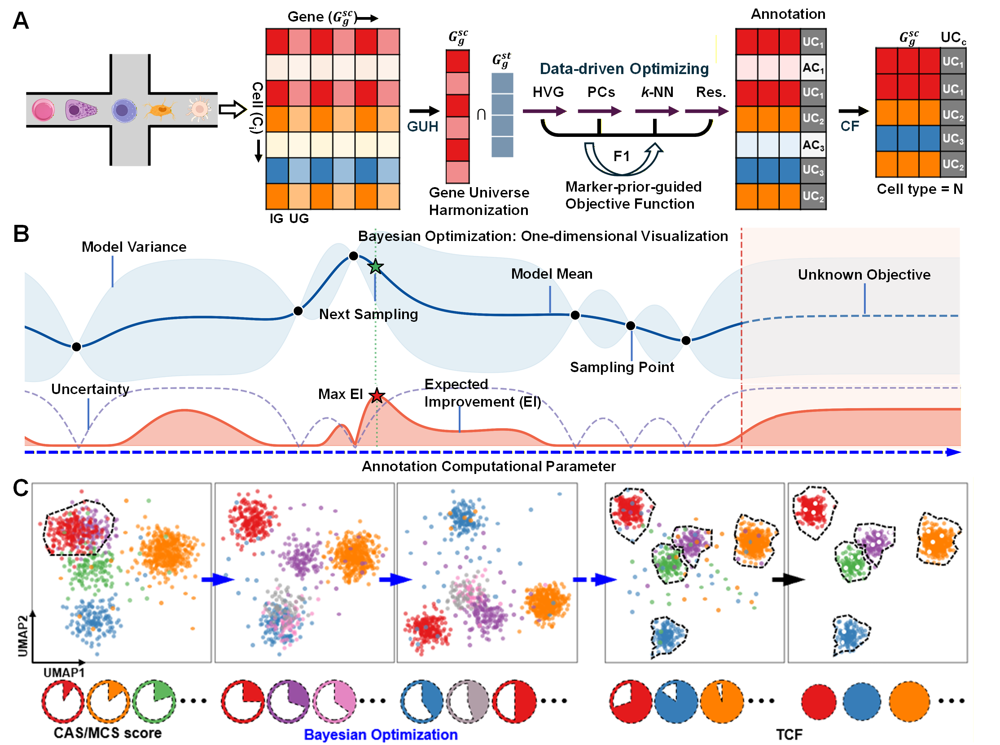
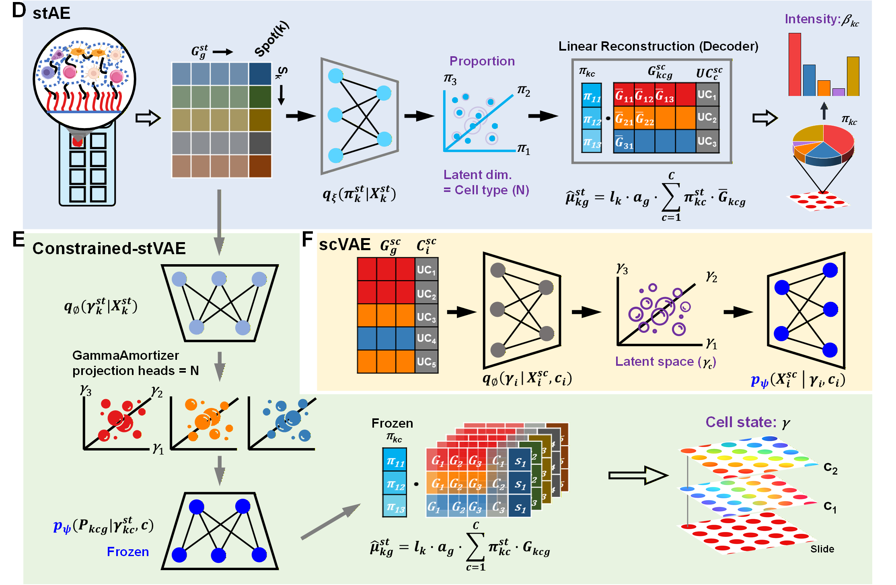

<h1 align="center">🕹️ ARCADE 🧬</h1>
<p align="center"><b>A</b>uto-optimized <b>R</b>eference <b>C</b>onsensus <b>A</b>nd <b>D</b>ecoupling <b>E</b>ngine</p>


#  01a_ARCADE_ref_optimizer: python version 

**01a_ARCADE_ref_optimizer** is an integrated, two-stage computational pipeline for single-cell RNA sequencing (scRNA-seq) analysis. It automates the discovery of optimal processing parameters using Bayesian Optimization (Stage 1) and then applies these parameters to a comprehensive downstream analysis workflow (Stage 2). The pipeline also features an optional multi-level refinement process (Stage 3/4) to iteratively re-analyze and improve annotations for low-confidence cell clusters.

---

## ARCADE Workflow Overview

<p align="center">
  <br>
</p>

---

## Key Features

-   **Automated Parameter Tuning**: Uses Bayesian Optimization to find the best parameters (`n_highly_variable_genes`, `n_pcs`, `n_neighbors`, `resolution`) for clustering and cell type annotation.
-   **Multi-Metric Objective Function**: Optimizes for a balanced score that considers annotation accuracy (CAS), marker gene specificity (MCS), Marker Prior Score (MPS), and cluster separation (Silhouette score).
-   **Marker Prior Score (MPS)**: Integrates external canonical marker databases to calculate F1-based scores validating cluster markers against known cell type signatures.
-   **Single & Multi-Sample Modes**: Natively supports analysis of a single dataset or the integration of two datasets (e.g., control vs. treated) using Harmony.
-   **Automatic Batch Detection**: Intelligently detects batch information from barcode suffixes or existing metadata columns.
-   **Iterative Refinement**: Automatically identifies low-confidence cell clusters and re-runs the entire optimization and analysis pipeline on them to improve annotation granularity and accuracy.
-   **Consistent Cell Export**: Exports high-confidence cells where multiple annotation methods agree, with optional deconvolution reference files for spatial transcriptomics integration.
-   **Comprehensive Outputs**: Generates publication-quality plots, detailed metric reports, annotated data objects (`.h5ad`), and summary tables for easy interpretation.

---

## Repository Structure
```text
ARCADE/
├── .gitignore
├── LICENSE
├── README.md
├── requirements.txt
├── marker_gene_reference/            # Canonical marker databases
│   ├── combined_markers_summary.csv  # Ready-to-use combined database for MPS calculation
│   ├── Cell_marker_All.csv           # Source database: CellMarker
│   └── PanglaoDB_markers_27_Mar_2020.csv # Source database: PanglaoDB
├── 01a_ARCADE_ref_optimizer.py       # Stage 1: Python-based reference optimizer (Scanpy)
├── 01b_ARCADE_ref_optimizer.R        # Stage 1: R-based reference optimizer (Seurat)
└── 02_ARCADE_spatial_decoupler.py    # Stage 2: Spatial deconvolution and cell state inference
```

---

## Step-by-Step Workflow

### 1. Prerequisites

-   Git installed on your system.
-   Python 3.8 or newer.
-   Access to a Linux-based command line.

### 2. Clone the Repository

```bash
git clone https://github.com/QiangSu/ARCADE.git
cd ARCADE
```

### 3. Set Up a Python Environment (Recommended)

Using a virtual environment prevents conflicts with other Python projects.

```bash
# Create a new conda environment with Python 3.9
conda create -n ARCADE_env python=3.9

# Activate the environment
conda activate ARCADE_env

```

```bash
# Create a virtual environment named 'venv'
python3 -m venv venv

# Activate the environment
source venv/bin/activate

# To deactivate later, simply run: deactivate
```

### 4. Install Dependencies

The `requirements.txt` file contains the exact library versions for perfect reproducibility.

```bash
pip install -r requirements.txt
```

### 5. Prepare Your Data

-   **scRNA-seq Data**: Ensure your Cell Ranger output (the folder containing barcodes.tsv.gz, features.tsv.gz, and matrix.mtx.gz) is accessible. The pipeline also accepts .h5 or .h5ad files.
-   **CellTypist Model**: Download a pre-trained CellTypist model (.pkl file). You can find available models on the official CellTypist models website.
-   **Marker Prior Database**: We provide a ready-to-use, integrated database located at `marker_gene_reference/combined_markers_summary.csv`. This file cleanly combines canonical markers from CellMarker and PanglaoDB. You can pass this directly to the `--marker_prior_db` argument! Expected columns if you use your own: species, organ, cell_type, marker_genes (semicolon-separated), gene_count.

### 6. Run the Pipeline

Here is an example command for a standard analysis:

```bash
python 01a_ARCADE_ref_optimizer.py \
  --data_dir /home/data/ST_scRNA-data/DLPFC_data/Br6432_Ant_IF/scRNA/combined_fastq/Br6432_ant_output/outs/filtered_feature_bc_matrix \
  --st_data_dir /home/data/ST_scRNA-data/DLPFC_data/Br6432_Ant_IF/stRNA \
  --output_dir /home/data/ST_scRNA-data/DLPFC_data/Br6432_Ant_IF/scRNA/combined_fastq/Br6432_ant_output/outs/filtered_feature_bc_matrix/Celltypist_BO_leiden_noMPS_git1 \
  --model_path /home/data/.celltypist/data/models/Adult_Human_PrefrontalCortex.pkl \
  --output_prefix Br \
  --final_run_prefix Br \
  --seed 42 \
  --n_calls 50 \
  --target all \
  --model_type biological \
  --deg_ranking_method composite \
  --mps_bonus_weight 0.0 \
  --marker_prior_db /home/data/references/combined_markers_summary.csv \
  --marker_prior_species Human \
  --marker_prior_organ Brain \
  --n_degs_for_mps 200 \
  --mps_similarity_threshold 0.7 \
  --mps_verbose_matching \
  --integration_method harmony \
  --batch_key sample \
  --cas_aggregation_method leiden \
  --refinement_depth 0 \
  --min_cells_per_type 10 \
  --hvg_min_mean 0.0125 \
  --hvg_max_mean 3.0 \
  --hvg_min_disp 0.3 \
  --fig_dpi 300
```

Single-sample refinement analysis

```bash
python 01a_ARCADE_ref_optimizer.py \
  --data_dir /home/data/ST_scRNA-data/DLPFC_data/Br6432_Ant_IF/scRNA/combined_fastq/Br6432_ant_output/outs/filtered_feature_bc_matrix \
  --st_data_dir /home/data/ST_scRNA-data/DLPFC_data/Br6432_Ant_IF/stRNA \
  --output_dir /home/data/ST_scRNA-data/DLPFC_data/Br6432_Ant_IF/scRNA/combined_fastq/Br6432_ant_output/outs/filtered_feature_bc_matrix/Celltypist_BO_leiden_noMPS_git1 \
  --model_path /home/data/.celltypist/data/models/Adult_Human_PrefrontalCortex.pkl \
  --output_prefix Br \
  --final_run_prefix Br \
  --seed 42 \
  --n_calls 50 \
  --target all \
  --model_type biological \
  --deg_ranking_method composite \
  --mps_bonus_weight 0.0 \
  --marker_prior_db /home/data/references/combined_markers_summary.csv \
  --marker_prior_species Human \
  --marker_prior_organ Brain \
  --n_degs_for_mps 200 \
  --mps_similarity_threshold 0.7 \
  --mps_verbose_matching \
  --integration_method harmony \
  --batch_key sample \
  --cas_aggregation_method leiden \
  --cas_refine_threshold 50 \
  --refinement_depth 3 \
  --min_cells_refinement 100 \
  --min_cells_per_type 10 \
  --hvg_min_mean 0.0125 \
  --hvg_max_mean 3.0 \
  --hvg_min_disp 0.3 \
  --fig_dpi 300
```
---

## Command-Line Arguments Explained

### Stage 1 & 2: Main I/O and Mode

| Argument | Description | Explanation/Usage |
|----------|-------------|-------------------|
| `--data_dir <path>` | Path to expression data. | **(Single-Sample Mode)** Path to 10x directory, `.h5` file, or `.h5ad` file. |
| `--multi_sample <path1> <path2>` | Two paths for WT and Treated data. | **(Multi-Sample Mode)** First path for control/WT, second for treated/perturbed. Enables Harmony integration. |
| `--output_dir <path>` | Path for all output files. | Main directory for results. Subdirectories for each stage are created automatically. |
| `--model_path <path>` | Path to CellTypist model (`.pkl`). | **Required.** Pre-trained model for cell type annotation. |
| `--output_prefix <str>` | Base prefix for Stage 1 output files. | Default: `bayesian_opt`. |
| `--st_data_dir <path>` | Path to Spatial Transcriptomics data. | **(Optional)** For gene intersection and deconvolution reference export. |

### Stage 1 & 2: Batch Integration Options

| Argument | Description | Explanation/Usage |
|----------|-------------|-------------------|
| `--batch_key <str>` | Column name for batch information. | If not specified, auto-detects from metadata or barcode suffixes. |
| `--no_integration` | Force single-sample mode. | Skips Harmony integration even if batches are detected. |
| `--integration_method <choice>` | Integration method. | `harmony` (default) or `none`. |

### Stage 1: Optimization Parameters

| Argument | Description | Explanation/Usage |
|----------|-------------|-------------------|
| `--seed <int>` | Global random seed. | Default: `42`. Ensures reproducibility. |
| `--n_calls <int>` | Trials per optimization strategy. | Default: `50`. Three strategies run, so total is 150 trials. |
| `--model_type <choice>` | Objective function type. | `biological` (default): CAS & MCS. `structural`: adds Silhouette. `silhouette`: Silhouette only. |
| `--marker_gene_model <choice>` | Genes for MCS calculation. | `non-mitochondrial` (default) or `all`. |
| `--target <choice>` | Optimization target. | `all` (default): balanced. Or `weighted_cas`, `simple_cas`, `mcs`. |
| `--cas_aggregation_method <choice>` | CAS calculation method. | `leiden` (default): per-cluster. `consensus`: per-cell-type. |

### Stage 1 & 2: HVG Selection Method

| Argument | Description | Explanation/Usage |
|----------|-------------|-------------------|
| `--hvg_min_mean <float>` | Min mean for two-step HVG. | Activates pre-filtering if set with other HVG params. |
| `--hvg_max_mean <float>` | Max mean for two-step HVG. | See above. |
| `--hvg_min_disp <float>` | Min dispersion for two-step HVG. | See above. |

### Stage 1 & 2: QC & Filtering Parameters

| Argument | Description | Explanation/Usage |
|----------|-------------|-------------------|
| `--min_genes <int>` | Min genes per cell. | Default: `200`. Filters low-quality cells. |
| `--max_genes <int>` | Max genes per cell. | Default: `7000`. Filters potential doublets. |
| `--max_pct_mt <float>` | Max mitochondrial percentage. | Default: `10.0`. Filters dying cells. |
| `--min_cells <int>` | Min cells per gene. | Default: `3`. Filters negligible genes. |

### Stage 2 & Optional Refinement: Final Run Parameters

| Argument | Description | Explanation/Usage |
|----------|-------------|-------------------|
| `--final_run_prefix <str>` | Prefix for Stage 2 outputs. | Default: `sc_analysis_repro`. |
| `--fig_dpi <int>` | Figure resolution. | Default: `500`. |
| `--n_pcs_compute <int>` | PCs to compute. | Default: `105`. |
| `--n_top_genes <int>` | Top markers to show. | Default: `5`. |
| `--cellmarker_db <path>` | Cell marker database CSV. | **(Optional)** For manual-style annotation. |
| `--n_degs_for_capture <int>` | DEGs for Marker Capture Score. | Default: `5`. |
| `--cas_refine_threshold <float>` | CAS threshold for refinement. | **(Optional)** Triggers re-analysis of low-confidence clusters. |
| `--refinement_depth <int>` | Max refinement iterations. | Default: `1`. |
| `--min_cells_refinement <int>` | Min cells for refinement. | Default: `100`. |
| `--min_cells_per_type <int>` | Min cells per type for export. | **(Optional)** Filters small populations from consistent cell export. |

### Marker Prior Score (MPS) Options

| Argument | Description | Explanation/Usage |
|----------|-------------|-------------------|
| `--marker_prior_db <path>` | External marker database CSV. | Expected columns: `species`, `organ`, `cell_type`, `marker_genes`, `gene_count`. |
| `--marker_prior_species <str>` | Species filter. | Default: `Human`. |
| `--marker_prior_organ <str>` | Organ filter. | **(Optional)** E.g., `Adipose`, `Brain`. |
| `--mps_bonus_weight <float>` | MPS bonus weight. | Default: `0.2`. Maximum bonus MPS adds to base score. |
| `--n_degs_for_mps <int>` | DEGs for MPS calculation. | Default: `50`. |
| `--protect_canonical_markers` | Protect markers in HVG. | Ensures canonical markers are included in HVG selection. |
| `--penalize_unmatched_clusters` | Penalize unmatched clusters. | Default: `True`. Unmatched clusters receive MPS=0. |
| `--deg_ranking_method <choice>` | DEG ranking method. | `original` (default): log2FC only. `composite`: weighted combination. |
| `--deg_weight_fc <float>` | Weight for log2FC. | Default: `0.4`. For composite ranking. |
| `--deg_weight_expr <float>` | Weight for expression. | Default: `0.3`. For composite ranking. |
| `--deg_weight_pct <float>` | Weight for pct difference. | Default: `0.3`. For composite ranking. |
| `--mps_similarity_threshold <float>` | Fuzzy matching threshold. | Default: `0.6`. Minimum similarity for cell type matching. |
| `--mps_verbose_matching` | Verbose matching output. | Prints detailed matching info for debugging. |
| `--mps_min_cells_per_group <int>` | Min cells for MPS. | Default: `5`. Clusters below this get MPS=0. |

---

## Output Directory Structure

The script generates a structured output directory. Below is an example structure and an explanation of key files.

```
<output_dir>/
├── stage_1_bayesian_optimization/
│   ├── bayesian_opt_biological_balanced_FINAL_annotated.h5ad
│   ├── bayesian_opt_biological_balanced_FINAL_best_params.txt
│   ├── bayesian_opt_biological_balanced_yield_scores_report.csv
│   ├── bayesian_opt_biological_balanced_optimizer_convergence.png
│   ├── bayesian_opt_biological_balanced_BO-EI_opt_result.skopt
│   ├── ...
│
├── stage_2_final_analysis/
│   ├── sc_analysis_repro_final_processed.h5ad
│   ├── sc_analysis_repro_final_processed_with_refinement.h5ad
│   ├── sc_analysis_repro_all_annotations.csv
│   ├── sc_analysis_repro_all_annotations_with_refinement.csv
│   ├── ...
│
├── marker_based_annotation/
│   ├── sc_analysis_repro_marker_based_annotation.csv
│   ├── sc_analysis_repro_marker_based_annotation_umap.png
│   └── celltype_marker_details/
│       ├── sc_analysis_repro_celltype_top_markers.csv
│       ├── sc_analysis_repro_celltype_matching_summary.csv
│       ├── sc_analysis_repro_celltype_canonical_overlap.csv
│       └── sc_analysis_repro_celltype_hvg_genes.csv
│
└── consistent_cells_subset/
    ├── sc_analysis_repro_consistent_cells_*.csv
    ├── sc_analysis_repro_consistent_cells_*_umap.png
    ├── sc_analysis_repro_consistency_context_all_cells_umap.png
    ├── sc_counts.csv                    # For deconvolution
    ├── sc_labels.csv                    # For deconvolution
    ├── st_counts.csv                    # If --st_data_dir provided
    ├── refined_annotation_exports/      # If refinement was run
    │   ├── sc_analysis_repro_all_cells_REFINED_annotation_umap.png
    │   ├── sc_analysis_repro_REFINED_inconsistent_cells_grey_umap.png
    │   ├── sc_analysis_repro_all_cells_REFINED_annotations.csv
    │   ├── sc_analysis_repro_REFINED_cell_type_counts.csv
    │   └── deconvolution_reference_REFINED/
    │       ├── sc_counts.csv
    │       ├── sc_labels.csv
    │       ├── sc_labels_REFINED_with_comparison.csv
    │       └── REFINED_deconvolution_summary.txt
    └── ... (additional filtered exports if --min_cells_per_type) ...
```

## Key File Explanations

### Stage 1: `stage_1_bayesian_optimization/`

| File | Description |
|------|-------------|
| `*_FINAL_best_params.txt` | Summary of optimal parameters and final metrics. **Most important summary file.** |
| `*_FINAL_annotated.h5ad` | AnnData processed with best parameters, containing all annotations. |
| `*_yield_scores_report.csv` | Detailed log of all trials with parameters and scores (CAS, MCS, MPS, Silhouette). |
| `*_optimizer_convergence.png` | Plot showing score improvement over time for each strategy. |
| `*_opt_result.skopt` | Saved optimization state for reloading. |

### Stage 2: `stage_2_final_analysis/`

| File | Description |
|------|-------------|
| `*_final_processed.h5ad` | Final annotated AnnData from initial Stage 2 run. |
| `*_final_processed_with_refinement.h5ad` | Master AnnData with combined annotations after all refinement. |
| `*_FINAL_refined_annotations.csv` | Comprehensive cell-by-cell annotations with refinement status. |
| `*_cluster_annotation_scores.csv` | CAS scores for Leiden clusters and consensus groups. |
| `*_combined_cluster_annotation_scores.csv` | Concatenated CAS from all refinement levels. |
| `*_cell_type_journey_summary.csv` | Cell count and CAS changes across refinement stages. |
| `*_celltype_matching_diagnostics.csv` | Detailed matching between annotations and marker database. |
| `*_FINAL_refined_annotation_umap.png` | Primary output: UMAP with final refined annotations. |
| `*_refinement_before_after_comparison.png` | Side-by-side comparison of before/after refinement. |
| `*_cells_changed_by_refinement_umap.png` | UMAP highlighting cells that changed during refinement. |
| `celltype_marker_details/` | Detailed marker gene information per cell type. |

### Consistent Cells: `consistent_cells_subset/`

| File | Description |
|------|-------------|
| `sc_counts.csv` | Expression matrix for consistent cells (deconvolution input). |
| `sc_labels.csv` | Cell type labels for consistent cells (deconvolution input). |
| `st_counts.csv` | Spatial expression matrix (if `--st_data_dir` provided). |
| `*_consistent_cells_*_umap.png` | UMAP showing only consistent cells. |
| `*_consistency_context_all_cells_umap.png` | UMAP with inconsistent cells in grey. |
| `refined_annotation_exports/` | Additional exports using refined annotations. |

### Marker Gene Details: `stage_2_final_analysis/celltype_marker_details/`
*(Generated if `--marker_prior_db` is provided)*

| File | Description |
|------|-------------|
| `*_celltype_matching_summary.csv` | Summary of how annotated cell types matched the external marker database (Exact, Fuzzy, etc.). |
| `*_celltype_top_markers.csv` | Ranked list of the top differentially expressed marker genes per cell type. |
| `*_celltype_canonical_overlap.csv` | Detailed overlap metrics between calculated DEGs and known canonical markers. |
| `*_celltype_hvg_genes.csv` | Top Highly Variable Genes (HVGs) expressed per cell type. |

### Marker-Based Annotations 
*(Generated in main output or subset directories if `--marker_prior_db` is provided)*

| File | Description |
|------|-------------|
| `*_marker_based_annotation*.csv` | Cell-by-cell metadata including automatic marker-driven cell type predictions. |
| `*_marker_based_annotation*.png` | UMAP plots visualizing the marker-driven annotations. |

---

## Marker Prior Score (MPS) Details

The MPS feature validates cluster marker genes against a canonical marker database using **F1 Score**:
F1 = 2 × (Precision × Recall) / (Precision + Recall)
Where:

- **Precision** = `|DEGs ∩ Canonical| / |DEGs|` — What fraction of top DEGs are canonical markers?
- **Recall** = `|DEGs ∩ Canonical| / |Canonical|` — What fraction of canonical markers appear in top DEGs?

---
## Provided Marker Gene Databases

To make the ARCADE pipeline plug-and-play, we include a ready-to-use canonical marker database in the `marker_gene_reference/` directory:

- **`combined_markers_summary.csv` (Recommended)**: A fully integrated, deduplicated, and formatted database ready for the `--marker_prior_db` argument. It combines the data from both underlying sources.
- **`Cell_marker_All.csv`**: Raw source database containing comprehensive literature-curated human and mouse markers from CellMarker.
- **`PanglaoDB_markers_27_Mar_2020.csv`**: Raw source database containing single-cell derived markers from PanglaoDB.

*Usage Example:*
```bash
--marker_prior_db ./marker_gene_reference/combined_markers_summary.csv \
--marker_prior_species Human \
--marker_prior_organ Brain
```

---
## Cell Type Matching

The pipeline uses multiple matching strategies:

| Strategy | Description |
|----------|-------------|
| **Exact match** | Direct name match |
| **Case-insensitive match** | Ignores capitalization |
| **Normalized match** | Removes prefixes/suffixes, standardizes terms |
| **Substring match** | Detects partial matches |
| **Fuzzy match** | Uses similarity algorithms for approximate matching |

---

## Abbreviation Expansion

Common abbreviations are automatically expanded:

| Abbreviation | Expansion |
|--------------|-----------|
| `OPC` | `oligodendrocyte precursor cell` |
| `Astro` | `astrocyte` |
| `L5-6 Exc` | `layer 5-6 excitatory neuron` |
| ... | |
---
---


#  01b_ARCADE_ref_optimizer: R version


**01b_ARCADE_ref_optimizer.R** is an advanced, fully integrated R pipeline for preparing single-cell RNA-seq references. Leveraging Seurat and Harmony, it automates the discovery of optimal clustering parameters through Bayesian Optimization, performs batch integration, iteratively refines low-confidence cell populations, and conducts marker-based biological annotation to generate perfect inputs for spatial deconvolution (Stage 2).

## Key Features

-   **Automated Bayesian Optimization**: Dynamically finds the optimal hyperparameter combination (HVGs, PCs, neighbors, resolution) rather than relying on manual trial-and-error.
-   **Multi-Objective Scoring**: Balances structural integrity (Silhouette), classification accuracy (CAS), and biological relevance (Marker Prior Score/MPS).
-   **Native Batch Integration**: Built-in support for Harmony to seamlessly correct batch effects across complex single-cell datasets.
-   **Iterative Refinement**: Automatically detects "mixed" or low-confidence clusters and recursively re-optimizes them to resolve hidden cell states.
-   **Marker-Based Annotation**: Evaluates clusters against a provided marker database (e.g., CellMarker) to assign high-confidence biological labels automatically.
-   **Perfect Stage 2 Synchronization**: Generates exactly formatted .csv count and label files perfectly tailored for 02_ARCADE_spatial_decoupler.py.

---


## Step-by-Step Workflow

### 1. Prerequisites

-   R (version >= 4.1.0) installed on your system.
-   Access to a Linux/macOS command line.

### 2. Clone the Repository

```bash
git clone https://github.com/QiangSu/ARCADE.git
cd ARCADE
```

### 3.  Install R Dependencies

You can install the required R packages by opening your R console and running:

```bash
install.packages(c("argparse", "Seurat", "dplyr", "ggplot2", "ParBayesianOptimization"))
# Install Harmony for batch integration
install.packages("harmony")

```

### 4. Prepare Your Data

-   **scRNA-seq Data**: A directory containing 10x Genomics output (barcodes.tsv, features.tsv, matrix.mtx), or an .h5 file.
-   **Reference Seurat Object**: A pre-annotated .rds file used as the truth-base for calculating the Cell Annotation Score (CAS).
-   **Marker Database (Optional)**: A CSV file containing standard marker genes per cell type for the Marker Prior Score (MPS) biological validation.


### 5. Run the Pipeline

Basic Optimization

```bash
Rscript 01b_ARCADE_ref_optimizer.R \
  --data_dir /home/data/ST_scRNA-data/DLPFC_data/Br6432_Ant_IF/scRNA/combined_fastq/Br6432_ant_output/outs/filtered_feature_bc_matrix \
  --st_data_dir /home/data/ST_scRNA-data/DLPFC_data/Br6432_Ant_IF/stRNA \
  --output_dir /home/data/ST_scRNA-data/DLPFC_data/Br6432_Ant_IF/scRNA/combined_fastq/Br6432_ant_output/outs/filtered_feature_bc_matrix/Seurate_BO_leiden_noMPS1_git \
  --reference_path /home/data/references/brain/human_mtg_reference.rds \
  --reference_labels_col subclass_label \
  --reference_assay RNA \
  --output_prefix DLPFC \
  --final_run_prefix DLPFC \
  --species human \
  --seed 42 \
  --n_calls 30 \
  --n_init_points 10 \
  --target balanced \
  --model_type standard \
  --deg_ranking_method composite \
  --marker_db_path /home/data/references/combined_markers_summary.csv \
  --marker_prior_species human \
  --marker_prior_organ Brain \
  --mps_n_top_genes 200 \
  --mps_min_pct 0.1 \
  --mps_logfc_threshold 0.25 \
  --cas_aggregation_method leiden \
  --refinement_depth 0 \
  --min_cells_per_type 10 \
  --fig_dpi 300
```

Optimization with Refinement

```bash
Rscript 01b_ARCADE_ref_optimizer.R \
  --data_dir /home/data/ST_scRNA-data/DLPFC_data/Br6432_Ant_IF/scRNA/combined_fastq/Br6432_ant_output/outs/filtered_feature_bc_matrix \
  --st_data_dir /home/data/ST_scRNA-data/DLPFC_data/Br6432_Ant_IF/stRNA \
  --output_dir /home/data/ST_scRNA-data/DLPFC_data/Br6432_Ant_IF/scRNA/combined_fastq/Br6432_ant_output/outs/filtered_feature_bc_matrix/Seurate_BO_leiden_noMPS1_git \
  --reference_path /home/data/references/brain/human_mtg_reference.rds \
  --reference_labels_col subclass_label \
  --reference_assay RNA \
  --output_prefix DLPFC \
  --final_run_prefix DLPFC \
  --species human \
  --seed 42 \
  --n_calls 30 \
  --n_init_points 10 \
  --target balanced \
  --model_type standard \
  --deg_ranking_method composite \
  --marker_db_path /home/data/references/combined_markers_summary.csv \
  --marker_prior_species human \
  --marker_prior_organ Brain \
  --mps_n_top_genes 200 \
  --mps_min_pct 0.1 \
  --mps_logfc_threshold 0.25 \
  --cas_aggregation_method leiden \
  --cas_refine_threshold 50 \
  --refinement_depth 3 \
  --min_cells_refinement 50 \
  --min_cells_per_type 10 \
  --fig_dpi 300
```

---

## Command-Line Arguments Explained

### Stage 1 & 2: Main I/O and Mode

| Argument | Description | Explanation/Usage |
|----------|-------------|-------------------|
| `--data_dir <path>` | Path to input data. | Required. Accepts 10x directory, .h5, or matrix format. |
| `--output_dir <path>` | Directory for output files. | Default: ./output/. All results, plots, and CSVs go here. |
| `--output_prefix <str>` | Prefix for general outputs. | Default: scrna. Prepended to filenames. |
| `--final_run_prefix <str>` | Prefix for final analysis. | Default: final. Marks the optimal final output files. |

### Reference & Species Arguments

| Argument | Description | Explanation/Usage |
|----------|-------------|-------------------|
| `--reference_path <path>` | Path to reference object. | Required. Must be a Seurat .rds file |
| `--reference_labels_col` | Metadata column for labels. | Default: cell_type. Where to find annotations in the reference. |
| `--reference_assay <str>` | Assay to use from reference. | Default: RNA. |
| `--species <str>` | Species for standardization. | Default: human. Accepts human or mouse. |

### Optimization Parameters

| Argument | Description | Explanation/Usage |
|----------|-------------|-------------------|
| `--target <choice>` | Metric to optimize. | Default: balanced. Choices: balanced, weighted_cas, simple_cas, mcs, mps, all. |
| `--model_type <choice>` | Scoring logic model. | Default: annotation. Choices: annotation, structural, mps_integrated, mps_bonus. |
| `--n_calls <int>` | Total Bayesian iterations. | Default: 50. Number of hyperparameter combinations to test. |
| `--n_init_points <int>` | Initial random samples. | Default: 10. Helps the optimizer explore before exploiting. |
| `--cas_aggregation_method` | CAS score aggregation. | Default: leiden (cluster-level). Alternative: consensus. |

### Stage 1 & 2: HVG Selection Method

| Argument | Description | Explanation/Usage |
|----------|-------------|-------------------|
| `--hvg_min_mean <float>` | Min mean for two-step HVG. | Activates pre-filtering if set with other HVG params. |
| `--hvg_max_mean <float>` | Max mean for two-step HVG. | See above. |
| `--hvg_min_disp <float>` | Min dispersion for two-step HVG. | See above. |
---
---


#  02_ARCADE_spatial_decoupler

**02_ARCADE_spatial_decoupler** is a comprehensive deep learning pipeline for spatial transcriptomics deconvolution. It estimates cell type proportions, infers continuous cell states, and generates publication-quality visualizations. The pipeline implements a two-stage variational autoencoder framework (scVAE + stVAE) that leverages single-cell RNA-seq references to deconvolve spatial transcriptomics data.

---

## ARCADE Workflow Overview

<p align="center">
  
</p>

---

## Key Features

- **Two-Stage VAE Framework**: First trains a conditional VAE on single-cell reference (**scVAE**), then transfers learned representations to spatial deconvolution (**stVAE**).
- **Cell Type Proportion Estimation**: Learns softmax-normalized proportions with entropy and sparsity regularization for biologically meaningful decompositions.
- **Continuous Cell State Inference**: Captures within-cell-type phenotypic variation (`γ`) using empirical priors learned from single-cell data.
- **Gene Correction Factors**: Learns platform-specific gene correction factors (`α`) to account for technical differences between scRNA-seq and spatial platforms.
- **Pseudo-Spot Consistency Training**: Generates synthetic spots from single-cell data for self-supervised consistency regularization.
- **Two-Stage Training with Warm Start**: Option to initialize with stAE proportions before full VAE training for improved convergence.
- **Flexible Inference Modes**: Supports both amortized (neural network) and non-amortized (per-spot) inference for cell states.
- **Comprehensive Visualizations**: Generates spatial proportion maps, marker gene overlays, cell state continuums, UMAP embeddings, and co-occurrence heatmaps.
- **Marker Gene Analysis**: Computes marker gene rankings and differential expression with volcano plots.


## Step-by-Step Workflow

### 1. Prerequisites

-   Git installed on your system.
-   Python 3.8 or newer.
-   Access to a Linux-based command line.

### 2. Clone the Repository

```bash
git clone https://github.com/QiangSu/ARCADE.git
cd ARCADE
```

### 3. Set Up a Python Environment (Recommended)

Using a virtual environment prevents conflicts with other Python projects.

```bash
# Create a new conda environment with Python 3.9
conda create -n ARCADE_env python=3.9

# Activate the environment
conda activate ARCADE_env

```

```bash
# Create a virtual environment named 'venv'
python3 -m venv venv

# Activate the environment
source venv/bin/activate

# To deactivate later, simply run: deactivate
```

### 4. Install Dependencies

The `requirements.txt` file contains the exact library versions for perfect reproducibility.

```bash
pip install -r requirements.txt
```

### 5. Prepare Your Data

-   **scRNA-seq Reference**: A CSV file with rows as cells and columns as genes. The first column should be cell barcodes/IDs (index).
-   **scRNA-seq Labels**: A CSV file mapping cell barcodes to cell type labels.
-   **Spatial Transcriptomics Counts**: A CSV file with rows as spots and columns as genes. The first column should be spot barcodes (index).
-   **Spatial Coordinates (Optional)**: A CSV file with spot coordinates for spatial visualization. Supports 10x Genomics tissue_positions format or standard x,y columns.

### 6. Run the Pipeline

Basic Deconvolution (Full VAE Mode)

```bash
python 02_ARCADE_spatial_decoupler.py \
  --sc_counts /home/data/ST_scRNA-data/DLPFC_data/Br6432_Ant_IF/scRNA/combined_fastq/Br6432_ant_output/outs/filtered_feature_bc_matrix/Celltypist_BO_leiden_noMPS_git1/consistent_cells_subset/sc_counts.csv \
  --sc_labels /home/data/ST_scRNA-data/DLPFC_data/Br6432_Ant_IF/scRNA/combined_fastq/Br6432_ant_output/outs/filtered_feature_bc_matrix/Celltypist_BO_leiden_noMPS_git1/consistent_cells_subset/sc_labels.csv \
  --st_counts /home/data/ST_scRNA-data/DLPFC_data/Br6432_Ant_IF/scRNA/combined_fastq/Br6432_ant_output/outs/filtered_feature_bc_matrix/Celltypist_BO_leiden_noMPS_git1/consistent_cells_subset/st_counts.csv \
  --st_coords /home/data/ST_scRNA-data/DLPFC_data/Br6432_Ant_IF/stRNA/tissue_positions_list.csv \
  --output_dir /home/data/ST_scRNA-data/DLPFC_data/Br6432_Ant_IF/scRNA/combined_fastq/Br6432_ant_output/outs/filtered_feature_bc_matrix/Celltypist_BO_leiden_noMPS_git1/consistent_cells_subset/Br6432_ant_BO_ARCADE_result_git \
  --two_stage \
  --soft_constraint \
  --constraint_strength 0.1 \
  --decorrelate_gamma 0.01 \
  --sc_epochs 1000 \
  --st_epochs 15000 \
  --temperature 1.0 \
  --reg_entropy 0.1 \
  --reg_sparsity 0.1 \
  --presence_threshold 0.0 \
  --hex_orientation 0 \
  --include_unknown
```
---

## Command-Line Arguments Explained

### Input/Output Arguments

| Argument | Description | Explanation/Usage |
|----------|-------------|-------------------|
| `--sc_counts <path>` | Path to scRNA-seq counts CSV. | Required. Rows = cells, columns = genes, first column = barcode index. |
| `--sc_labels <path>` | Path to scRNA-seq labels CSV. | Required. Maps cell barcodes to cell type labels. |
| `--st_counts <path>` | Path to spatial counts CSV. | Required. Rows = spots, columns = genes, first column = barcode index. |
| `--st_coords <path>` | Path to spatial coordinates CSV. | Optional. Used for spatial visualization. Supports 10x format or standard x,y columns. |
| `--output_dir <path>` | Directory for output files. | Required. All results are saved here. |

### Model Architecture Arguments

| Argument | Description | Explanation/Usage |
|----------|-------------|-------------------|
| `--latent <int>` | Latent dimension size. | Default: 10. Controls γ dimensionality. |
| `--batch_size <int>` | Training batch size. | Default: 128. |
| `--gpu` | Force GPU usage if available. | Enables CUDA acceleration. |

### Training Arguments

| Argument | Description | Explanation/Usage |
|----------|-------------|-------------------|
| `--sc_epochs <int>` | scVAE training epochs. | Default: 200. Stage 1 reference training. |
| `--st_epochs <int>` | stVAE training epochs. | Default: 2000. Stage 2 spatial deconvolution. |
| `--lr <float>` | Learning rate. | Default: 0.005 |
| `--reg_entropy <float>` | Entropy regularization weight. | Default: 10.0. Higher values produce sharper proportions. |
| `--reg_sparsity <float>` | Sparsity regularization weight. | Default: 1.0. Encourages sparse proportions. |
| `--temperature <float>` | Softmax temperature. | Default: 0.5. Lower values produce sharper distributions. |

### Mode Selection Arguments

| Argument | Description | Explanation/Usage |
|----------|-------------|-------------------|
| `--mode <choice>` | Deconvolution mode. | full (default): VAE with cell states. proportion_only: proportions only. |
| `--proportion_method <choice>` | Method for proportion_only mode. | nnls, softmax_regression, or simplex_ae (default). |
| `--inference_mode <choice>` | Gamma inference mode. | amortized (default): neural network. non_amortized: per-spot parameters. |

### Two-Stage Training Arguments

| Argument | Description | Explanation/Usage |
|----------|-------------|-------------------|
| `--two_stage` | Enable two-stage training. | Runs stAE first, then stVAE with warm start. |
| `--freeze_proportions` | Fix proportions to stAE values. | No proportion learning in stVAE stage. |
| `--freeze_intensity` | Fix gene correction (α) to stAE values. | Constrains intensity patterns. |
| `--soft_constraint` | Use soft KL constraint on proportions. | Alternative to hard freezing. |
| `--constraint_strength <float>` | KL constraint strength. | Default: 10.0. Higher = closer to stAE. |
| `--decorrelate_gamma <float>` | Gamma-pi decorrelation weight. | Default: 0.0. Reduces γ–π correlation. |

### Pseudo-Spot Training Arguments

| Argument | Description | Explanation/Usage |
|----------|-------------|-------------------|
| `--use_pseudo_spots` | Enable pseudo-spot consistency training. | Generates synthetic spots for self-supervision. |
| `--n_pseudo_spots <int>` | Number of synthetic spots. | Default: 1000. |
| `--cells_per_spot_range <int> <int>` | Range of cells per pseudo-spot. | Default: 5 15. |
| `--pseudo_weight <float>` | Weight of pseudo-spot loss. | Default: 1.0. |
| `--pseudo_warmup_epochs <int>` | Warmup epochs for pseudo-spot. |Default: 50. Gradually increases weight. |
| `--pseudo_training_ratio <int>` | Ratio of pseudo to real batch size. | Default: 1. |

### Unknown Cell Type Arguments

| Argument | Description | Explanation/Usage |
|----------|-------------|-------------------|
| `--include_unknown` | Add unknown cell type category. | Captures cells not represented in the reference. |

### Visualization Arguments

| Argument | Description | Explanation/Usage |
|----------|-------------|-------------------|
| `--hex_orientation <float>` | Hexagon orientation in degrees. | Default: 0.0. 0 = pointy-top, 30 = flat-top. |
| `--presence_threshold <float>` | Minimum proportion for visualization. | Default: 0.05 (5%). Filters low-proportion spots. |
| `--latent_combination <choice>` | Method to combine latent dimensions. | pca (default), sum, norm, weighted, or latent0. |

---

## Mathematical Framework

scVAE (Stage 1: Reference Training)
The scVAE learns a conditional generative model for single-cell expression:

```math
\gamma_n \sim \mathcal{N}(0, I)
x_{ng} | \gamma_n, c_n \sim \text{NB}(l_n \times \rho_g(\gamma_n, c_n), \theta_g)
```
Where:
- **$\gamma_n$**: Latent cell state for cell $n$
- **$c_n$**: Cell type label for cell $n$
- **$l_n$**: Library size (total counts) for cell $n$
- **$\rho_g$**: Decoder mapping latent state + cell type to normalized expression
- **$\theta_g$**: Gene-specific dispersion parameter

stVAE (Stage 2: Spatial Deconvolution)
The stVAE decomposes spatial spots as mixtures of cell types:
```math
x_{sg} | \pi_s, \{\gamma_{sc}\} \sim \text{NB}(l_s \times \alpha_g \times \sum_c \pi_{sc} \times \rho_g(\gamma_{sc}, c), \theta_g)
\gamma_{sc} \sim \mathcal{N}(\mu_c, \Sigma_c) \quad \text{[empirical prior from scVAE]}
```

Where:
- **$\pi_s$**: Cell type proportions at spot $s$
- **$\gamma_{sc}$**: Cell-type-specific state at spot $s$ for type $c$
- **$\alpha_g$**: Gene-specific correction factor for platform differences
- **$\mu_c, \Sigma_c$**: Empirical prior learned from scRNA-seq latent states

Loss Function
```math
\mathcal{L} = \text{NLL} + \lambda_\gamma \text{KL}_\gamma + \lambda_\alpha \mathcal{L}_\alpha + \lambda_\pi \mathcal{L}_\pi
```
Where:
- **$\text{NLL}$**: Negative Binomial log-likelihood
- **$\text{KL}_\gamma$**: KL divergence for $\gamma$ against the empirical prior
- **$\mathcal{L}_\alpha$**: Regularization on gene correction factors
- **$\mathcal{L}_\pi$**: Entropy/sparsity regularization on proportions


## Output Directory Structure

The script generates a structured output directory. Below is an example structure and an explanation of key files.

```
<output_dir>/
├── stvae_model.pt
├── proportions.csv
├── intensity_maps.csv
├── intensity_maps_raw.csv
├── alpha_gene_correction.csv
├── gamma_states.npy
├── gamma_states_<celltype>.csv
├── imputed_expr_<celltype>.csv
├── denoised_tissue_reconstruction.csv
│
├── cooccurrence_heatmap.png
├── spatial_proportion_maps.png
├── spatial_dominant_type.png
├── latent_umap.png
├── marker_genes_summary.png
├── marker_genes_dotplot.png
├── marker_genes_<celltype>.png
│
├── continuum_<celltype>.png
├── continuum_full_<celltype>.png
├── spatial_state_<celltype>.png
├── global_umap_embedding.npy
│
├── marker_gene_rankings/
│   ├── <celltype>_markers.csv
│   └── ...
│
├── differential_expression/
│   ├── <celltype>_de.csv
│   ├── volcano_<celltype>.png
│   └── ...
│
├── gene_analysis_summary.txt
│
└── stvae_refined/
    ├── spatial_proportion_maps.png
    ├── spatial_dominant_type.png
    └── ...
```

## Key File Explanations

### Main Outputs

| File | Description |
|------|-------------|
| `proportions.csv` | Primary output. Cell type proportions per spot. Rows = spots, columns = cell types. |
| `intensity_maps.csv` | Normalized intensity (relative abundance) per cell type per spot. |
| `alpha_gene_correction.csv` | Gene-specific correction factors capturing platform differences. |
| `stvae_model.pt` | Saved model for reloading or transfer learning. |

### Cell State Outputs (Full Mode Only)

| File | Description |
|------|-------------|
| `gamma_states.npy` | Raw latent states. Shape: [n_spots, n_cell_types, n_latent]. |
| `gamma_states_<celltype>.csv` | Flattened gamma matrix for each cell type. Columns: Latent_0, Latent_1, ... |
| `imputed_expr_<celltype>.csv` | Imputed cell-type-specific expression per spot. |
| `denoised_tissue_reconstruction.csv` | Full tissue reconstruction: l_s × α × Σ(π × ρ). |

### Visualization Outputs

| File | Description |
|------|-------------|
| `spatial_proportion_maps.png` | Grid of spatial maps showing proportions per cell type. |
| `spatial_dominant_type.png` | Single map showing the dominant cell type per spot. |
| `cooccurrence_heatmap.png` | Heatmap showing cell type co-occurrence patterns. |
| `latent_umap.png` | UMAP embedding of spot-level latent representations. |
| `marker_genes_dotplot.png` | Seurat-style dot plot of marker gene expression. |
| `marker_genes_summary.png` | Summary showing top marker per cell type spatially. |
| `marker_genes_<celltype>.png` | Detailed marker gene spatial maps per cell type. |

### Cell State Continuum Visualizations (Full Mode Only)

| File | Description |
|------|-------------|
| `continuum_<celltype>.png` | UMAP + spatial map showing cell state variation for present spots only. |
| `continuum_full_<celltype>.png` | UMAP showing all spots colored by cell state using a consistent layout. |
| `spatial_state_<celltype>.png` | Spatial map of latent state values per cell type. |
| `global_umap_embedding.npy` | Saved UMAP embedding for consistent visualization. |

### Gene Analysis Outputs

| File | Description |
|------|-------------|
| `marker_gene_rankings/<celltype>_markers.csv` | Comprehensive marker gene ranking with multiple scores. |
| `differential_expression/<celltype>_de.csv` | Full differential expression table for one-vs-rest comparison. |
| `differential_expression/volcano_<celltype>.png` | Volcano plot of differential expression results. |
| `gene_analysis_summary.txt` | Summary statistics of marker and DE analysis. |

### Two-Stage Training Outputs (If --two_stage)

| File | Description |
|------|-------------|
| `proportions_stvae_refined.csv` | stVAE-refined proportions after warm start. |
| `intensity_maps_stvae_refined.csv` | stVAE-refined intensity maps. |
| `stvae_refined/spatial_proportion_maps.png` | Spatial maps using refined proportions. |
| `stvae_refined/spatial_dominant_type.png` | Dominant-type map using refined proportions. |
---

---

## Marker Gene Analysis Details

### Marker Ranking Scores

| Score | Description | Formula |
|----------|-------------|-------------------|
| Expression | Mean expression in reference profile | profile[c, g] |
| Specificity | Ratio to max of other types | profile[c, g] / max(profile[other, g]) |
| Log2 FC | Fold change vs mean of others | log2(profile[c] / mean(profile[other])) |
| Combined Score | Expression × log(1 + specificity) | Primary ranking metric |
| Gini Specificity | How specific to this type | Higher = more specific |
| Z-Score | Standardized expression | (expr - mean) / std |

### Differential Expression Statistics

| Metric | Description |
|----------|-------------|
| `log2_fold_change` | Log2 fold change of mean expression for this type vs others. | 
| `p_value` | Wilcoxon rank-sum test p-value. | 
| `p_adjusted` | Benjamini-Hochberg FDR-corrected p-value. | 
| `cohens_d` | Effect size estimate. | 
| `pct_expressing_this` | Percent of cells expressing the gene in this type. | 
| `pct_expressing_other` | Percent of cells expressing the gene in other types. | 

### Latent Combination Methods
The --latent_combination argument controls how multi-dimensional latent states are visualized.

| Method | Description | Use Case |
|----------|-------------|-------------------|
| pca | First principal component of latent dimensions | Default. Captures the main variance axis |
| sum | Simple sum across latent dimensions | Quick summary, may lose information |
| norm | L2 norm of the latent vector | Captures overall activation strength |
| weighted | Variance-weighted combination | Emphasizes high-variance dimensions |
| latent0 | First latent dimension only | Original behavior, single-dimension view |

---

## License

This project is licensed under the MIT License. See the `LICENSE` file for details.